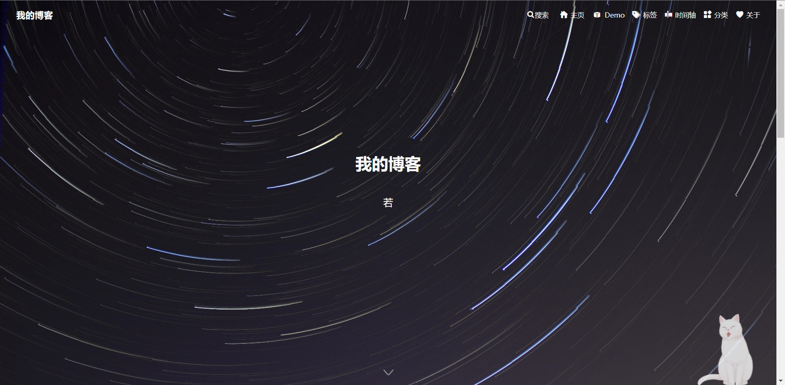
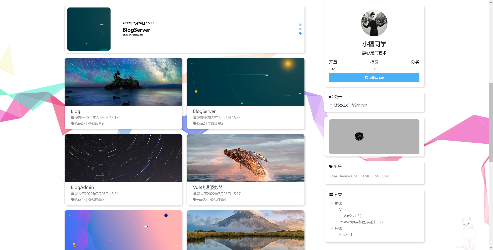
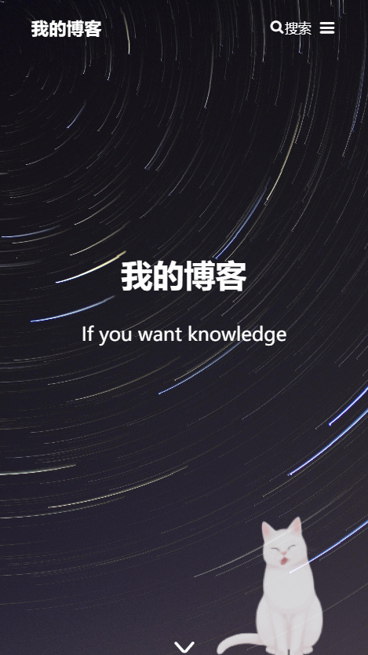
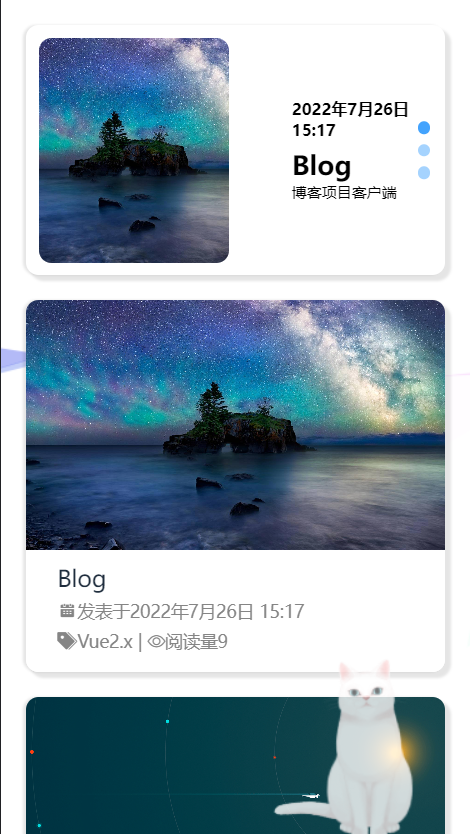

# Blog

个人博客用户端，Vue2 开发前后端分离项目。如果界面你看着眼熟，是因为就是仿照人家的主题写的。  
[点击查看演示](http://8.219.187.214/#/home)

# 技术

1. 界面是 element-ui 组件 + 自己写的样式
2. 响应式 element-ui 提供了响应尺寸和基于断点的隐藏类
   - import 'element-ui/lib/theme-chalk/display.css';
   - xs、sm、md、lg 和 xl
3. markdown 解析 -markdown-it-vue 库
4. 轮播图 element-ui Carousel 走马灯
5. 打字机特效 theaterjs
6. 路由 vue-router
7. 状态管理 vuex
8. 评论组件 bright-comment
9. 网络请求 axios
10. sass
11. 界面上那只猫
```html
 <script src="https://eqcn.ajz.miesnfu.com/wp-content/plugins/wp-3d-pony/live2dw/lib/L2Dwidget.min.js"></script>
  <script>
    L2Dwidget.init({ "model": { jsonPath:
          "https://unpkg.com/live2d-widget-model-tororo@1.0.5/assets/tororo.model.json",
	       "scale": 1 }, "display": { "position": "right", "width": 80, "height": 90,
	       "hOffset": 0, "vOffset": -20 }, "mobile": { "show": true, "scale": 0.1 },
	       "react": { "opacityDefault": 0.8, "opacityOnHover": 0.1 } });
  </script>
```

# 搭建

1. 先搭建 BlogServer
2. npm install 安装依赖
3. npm run serve 开启服务器

# 截图
## pc端home界面


## 移动端home界面
